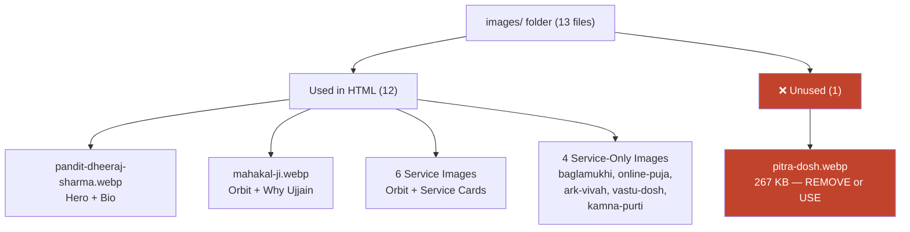

# 🔍 Code Review & Analysis — kalsharppooja.in

> **File reviewed**: [index.html](file:///d:/Cohort%202.0%20Sheriyans%20Dev/Projects/kalsharppooja.in/website/index.html) (1,030 lines, ~54 KB)
> **Images folder**: [images/](file:///d:/Cohort%202.0%20Sheriyans%20Dev/Projects/kalsharppooja.in/website/images) (13 files, ~3.5 MB total)
> **Review date**: 7 September 2026

---

## 📋 Project Summary

A **single-page, static landing page** for Pandit Dheeraj Sharma's Vedic puja services in Ujjain, Madhya Pradesh. The site targets Hindi-speaking users seeking Kaal Sarp Dosh, Mangal Dosh, Navgraha Shanti, and other dosh-nivaran pujas. The primary conversion goal is phone calls / WhatsApp messages.

---

## 🏗️ Architecture Overview

| Aspect         | Detail                                                         |
| -------------- | -------------------------------------------------------------- |
| **Type**       | Static single-page HTML (no framework)                         |
| **CSS**        | Inline `<style>` block (~510 lines) — no external stylesheet   |
| **JavaScript** | Inline `<script>` block (~40 lines) — vanilla JS, no libraries |
| **Fonts**      | Google Fonts: Yatra One, Cormorant Garamond, Work Sans         |
| **Backend**    | None — form submits redirect to WhatsApp                       |
| **Hosting**    | Intended for static hosting (no server-side dependency)        |

---

## 🎨 Design & Visual Analysis

### Color Palette (CSS Custom Properties)

| Token                        | Value                 | Usage                                  |
| ---------------------------- | --------------------- | -------------------------------------- |
| `--ivory`                    | `#FBF3E4`             | Primary background                     |
| `--maroon` / `--maroon-deep` | `#7A1F2B` / `#5A1420` | Headings, CTAs, accents                |
| `--gold` / `--gold-soft`     | `#C9962C` / `#E8C978` | Highlights, linears, borders           |
| `--night`                    | `#2C121C`             | Dark sections (hero, benefits, footer) |
| `--vermillion`               | `#C1432B`             | Eyebrow labels                         |
| `--accent-teal`              | `#1F6F5C`             | Check marks in benefits                |

> [!TIP]
> The color palette is **well-curated** — warm ivory/gold/maroon evokes a traditional temple aesthetic, perfectly matching the brand. The teal accent for checkmarks provides good contrast.

### Typography

- **Yatra One** — Devanagari display font used for headings (`h1`, `h2`, `h3`)
- **Cormorant Garamond** — Serif italic for lead paragraphs and accent text
- **Work Sans** — Sans-serif for body text, labels, and UI elements

### Signature Visual Elements

1. **Temple-arch photo frame** (`.arch-frame`) — A rounded-top frame inspired by temple arches, with gold linear border
2. **Orbiting puja images** (`.hero-orbit`) — Images orbit in two counter-rotating rings behind the hero (CW at 40s, CCW at 60s)
3. **Floating WhatsApp button** (`.wa-float`) — Fixed bottom-right with a pulse animation

---

## 📑 Page Sections (Top → Bottom)

| #   | Section                    | Class/Element  | Lines   | Purpose                                                     |
| --- | -------------------------- | -------------- | ------- | ----------------------------------------------------------- |
| 1   | **Top Bar**                | `.topbar`      | 620–628 | Sticky nav with brand name + WhatsApp/Call CTAs             |
| 2   | **Hero**                   | `header.hero`  | 631–668 | Main value proposition, pandit photo, stats, CTAs           |
| 3   | **Problem Identification** | `.problems`    | 671–687 | 6 problem cards addressing visitor pain points              |
| 4   | **Why Ujjain**             | `.why-section` | 690–704 | Mahakal Ji image + text explaining Ujjain's significance    |
| 5   | **Pandit Bio**             | `.bio`         | 707–725 | Circular photo frame + credentials/pills                    |
| 6   | **Services**               | `.services`    | 728–817 | 10 service cards with images, descriptions, "Book Now" CTAs |
| 7   | **Video Gallery**          | `.videos`      | 820–858 | 4 YouTube videos (2 portrait, 1 landscape, 1 repeat)        |
| 8   | **Benefits**               | `.benefits`    | 861–878 | 8 benefit cards with checkmarks on dark background          |
| 9   | **Booking Process**        | `.steps`       | 881–895 | 5-step numbered process using CSS counters                  |
| 10  | **FAQ**                    | `.faq`         | 898–927 | 5 accordion-style Q&As                                      |
| 11  | **Contact Form**           | `.contact`     | 930–957 | Name/Mobile/Message form → WhatsApp redirect                |
| 12  | **Final CTA**              | `.final-cta`   | 960–971 | linear banner with dual phone numbers + WhatsApp            |
| 13  | **Footer**                 | `footer`       | 973–979 | Brand, address, copyright                                   |
| 14  | **Floating WhatsApp**      | `.wa-float`    | 981–985 | Persistent floating button with pre-filled message          |

---

## 🖼️ Images Audit

### Inventory (13 files)

| File                         | Size   | Used In                        | Alt Text                         |
| ---------------------------- | ------ | ------------------------------ | -------------------------------- |
| `pandit-dheeraj-sharma.webp` | 119 KB | Hero arch-frame, Bio circle    | ✅ Descriptive                   |
| `mahakal-ji.webp`            | 327 KB | Hero orbit, Why Ujjain section | ⚠️ Orbit: empty alt; Section: ✅ |
| `kaal-sarp-dosh.webp`        | 299 KB | Hero orbit, Services card      | ⚠️ Orbit: empty alt; Card: ✅    |
| `mangal-dosh.webp`           | 302 KB | Hero orbit, Services card      | ⚠️ / ✅                          |
| `navgrah-shanti.webp`        | 290 KB | Hero orbit, Services card      | ⚠️ / ✅                          |
| `rudrabhishek.webp`          | 284 KB | Hero orbit, Services card      | ⚠️ / ✅                          |
| `mahamrityunjay-jaap.webp`   | 287 KB | Hero orbit, Services card      | ⚠️ / ✅                          |
| `baglamukhi-hawan.webp`      | 309 KB | Services card                  | ✅                               |
| `online-puja-booking.webp`   | 269 KB | Services card                  | ✅                               |
| `ark-vivah.webp`             | 301 KB | Services card                  | ✅                               |
| `vastu-dosh.webp`            | 281 KB | Services card                  | ✅                               |
| `kamna-purti.webp`           | 297 KB | Services card                  | ✅                               |
| `pitra-dosh.webp`            | 267 KB | ❌ **NOT USED** in HTML        | —                                |

### Image Quality Assessment

- **Pandit photo** (~119 KB): Professional portrait with pre-designed temple-arch frame baked into the image itself. Good quality.
- **Service images** (~270–330 KB each): These are **pre-designed marketing posters** with Hindi text overlays, not raw photographs. They are rich and detailed — suitable for the target audience.
- **Mahakal Ji** (~327 KB): A high-quality photo of the Mahakaleshwar deity — authentic and well-composed.

> [!WARNING]
> **`pitra-dosh.webp`** (267 KB) exists in the images folder but is **never referenced** in the HTML. Either add a Pitra Dosh service card or remove the unused file to keep the deployment lean.

### Image Performance Concerns

| Issue                       | Detail                                                         |
| --------------------------- | -------------------------------------------------------------- |
| **No WebP/AVIF**            | All images are JPEG only — no modern format alternatives       |
| **No `srcset`/`<picture>`** | No responsive image variants for mobile devices                |
| **Total image payload**     | ~3.5 MB (all 13 files) — heavy for mobile-first Hindi audience |
| **No explicit dimensions**  | Missing `width`/`height` attributes causes layout shift (CLS)  |

---

## ✅ What's Done Well

### SEO

- ✅ Proper `<title>` tag with keyword-rich, descriptive content
- ✅ `<meta name="description">` with relevant Hindi/English keywords
- ✅ `<meta name="keywords">` with targeted terms
- ✅ `<link rel="canonical">` pointing to the production URL
- ✅ **JSON-LD structured data** for `ReligiousOrganization` with full service listings
- ✅ **JSON-LD FAQPage** schema — FAQ can appear as rich snippets in Google
- ✅ **Open Graph** tags for WhatsApp/Facebook sharing
- ✅ `lang="hi"` set correctly on `<html>`

### Accessibility

- ✅ `prefers-reduced-motion` media query disables animations
- ✅ Orbit images in hero use empty `alt=""` (decorative — correct)
- ✅ WhatsApp float has `aria-label`
- ✅ Form fields have proper `<label>` elements with `for` attributes
- ✅ Input validation with `pattern` and `required`

### Code Quality

- ✅ Clean, semantic HTML structure (`<header>`, `<section>`, `<footer>`)
- ✅ CSS custom properties for consistent theming
- ✅ No external JS dependencies — zero bloat
- ✅ Smart WhatsApp form strategy — no backend server needed
- ✅ YouTube lazy-load pattern (thumbnail + click-to-play) avoids iframe overhead
- ✅ `loading="lazy"` on all below-the-fold images
- ✅ `fetchpriority="high"` on the hero pandit image
- ✅ CSS `counter-reset`/`counter-increment` for numbered steps (maintainable)

### Responsiveness

- ✅ Three-tier responsive breakpoints: `>900px`, `560–900px`, `<560px`
- ✅ Grid layouts gracefully collapse (`4→2→1` columns)
- ✅ `clamp()` used for fluid heading sizes
- ✅ Orbit animation hidden on mobile to save performance

---

## ⚠️ Issues & Improvement Opportunities

### Critical

| #   | Issue                                   | Location                                                                                                                     | Impact                                                                                                                                             |
| --- | --------------------------------------- | ---------------------------------------------------------------------------------------------------------------------------- | -------------------------------------------------------------------------------------------------------------------------------------------------- |
| 1   | **No `<meta og:url>`**                  | Head                                                                                                                         | WhatsApp/Facebook share preview may not resolve correctly                                                                                          |
| 2   | **OG image uses relative path**         | [Line 16](file:///d:/Cohort%202.0%20Sheriyans%20Dev/Projects/kalsharppooja.in/website/index.html#L16)                        | OG image must be an **absolute URL** (e.g., `https://kaalsarpdoshnivaranujjain.com/images/pandit-dheeraj-sharma.webp`) for social previews to work |
| 3   | **Structured data image also relative** | [Line 25](file:///d:/Cohort%202.0%20Sheriyans%20Dev/Projects/kalsharppooja.in/website/index.html#L25)                        | Google requires absolute URLs in JSON-LD                                                                                                           |
| 4   | **Duplicate video**                     | [Lines 828–834 vs 849–855](file:///d:/Cohort%202.0%20Sheriyans%20Dev/Projects/kalsharppooja.in/website/index.html#L828-L855) | Video ID `rDZ8237RUyM` appears **twice** — likely a placeholder mistake                                                                            |

### Performance

| #   | Issue                                  | Recommendation                                                                |
| --- | -------------------------------------- | ----------------------------------------------------------------------------- |
| 5   | **510 lines of CSS inline**            | Extract to external `styles.css` for cacheability                             |
| 6   | **No font `preconnect` for gstatic**   | Add `<link rel="preconnect" href="https://fonts.gstatic.com" crossorigin>`    |
| 7   | **Large image payloads**               | Convert to WebP (typically 30-50% smaller), add `srcset` for responsive sizes |
| 8   | **Missing `width`/`height` on images** | Add explicit dimensions to prevent Cumulative Layout Shift                    |
| 9   | **No favicon**                         | Add `<link rel="icon">` — currently shows default browser icon                |

### Functionality

| #   | Issue                        | Detail                                                                                                                                                                                                                            |
| --- | ---------------------------- | --------------------------------------------------------------------------------------------------------------------------------------------------------------------------------------------------------------------------------- |
| 10  | **Form has no real backend** | Data only goes to WhatsApp — if WhatsApp popup is blocked, the lead is lost. Consider adding a simple backend (Formspree, Google Forms, or a serverless function).                                                                |
| 11  | **No form validation UX**    | No visual error states for invalid inputs — browser defaults only                                                                                                                                                                 |
| 12  | **WhatsApp text encoding**   | [Line 1001](file:///d:/Cohort%202.0%20Sheriyans%20Dev/Projects/kalsharppooja.in/website/index.html#L1001): Uses `%0a` directly in template literal instead of `encodeURIComponent()` — may cause encoding issues in some browsers |

### SEO / Content

| #   | Issue                             | Detail                                                                                                                  |
| --- | --------------------------------- | ----------------------------------------------------------------------------------------------------------------------- |
| 13  | **No `<nav>` element**            | Topbar should use `<nav>` for better semantics                                                                          |
| 14  | **Mixed Hindi/English headings**  | Some section titles are in English (e.g., "Frequently Asked Questions") while body is Hindi. Consistency would help SEO |
| 15  | **No `hreflang` tag**             | Since the page is Hindi, add `<link rel="alternate" hreflang="hi" href="...">`                                          |
| 16  | **Service cards lack unique IDs** | Each service section should have anchor IDs for deep linking (e.g., `#kaal-sarp-dosh`)                                  |

### Accessibility

| #   | Issue                                   | Detail                                                                                                                                            |
| --- | --------------------------------------- | ------------------------------------------------------------------------------------------------------------------------------------------------- |
| 17  | **FAQ not using `
/
`** | Custom accordion works but lacks native keyboard/screen-reader support. Consider using native elements or adding `role="button"`, `aria-expanded` |
| 18  | **No skip-to-content link**             | Missing skip navigation for keyboard users                                                                                                        |
| 19  | **Color contrast**                      | Some light gold text on dark backgrounds may not meet WCAG AA ratio (e.g., `rgba(251,243,228,.7)` on `--night`)                                   |

---

## 📊 Image Usage Matrix

---

## 🧮 Code Statistics

| Metric                | Value                                          |
| --------------------- | ---------------------------------------------- |
| Total lines           | 1,030                                          |
| HTML lines (approx.)  | ~480                                           |
| CSS lines (approx.)   | ~510                                           |
| JS lines (approx.)    | ~40                                            |
| Sections              | 14 (including topbar, hero, footer)            |
| Service cards         | 10                                             |
| FAQ items             | 5                                              |
| YouTube embeds        | 4 (3 unique, 1 duplicate)                      |
| CTAs (Call/WhatsApp)  | 16+ throughout the page                        |
| CSS custom properties | 12                                             |
| Breakpoints           | 3 (`900px`, `560px`, `prefers-reduced-motion`) |

---

## 🎯 Prioritized Recommendations

### 🔴 High Priority (Fix Before Launch)

1. **Fix OG image and JSON-LD image URLs** to absolute paths
2. **Add `<meta property="og:url">`**
3. **Remove duplicate video** or replace with a unique video ID
4. **Add a favicon**

### 🟡 Medium Priority (Improves Quality)

5. Extract CSS to external `styles.css`
6. Convert images to **WebP** format with JPEG fallbacks
7. Add `width`/`height` to all `` tags
8. Add `<nav>` semantic wrapper to topbar
9. Add anchor IDs to service cards for deep linking
10. Either use `pitra-dosh.webp` or remove it

### 🟢 Nice-to-Have (Polishing)

11. Add ARIA attributes to FAQ accordion
12. Add skip-to-content link
13. Add a simple form backend as fallback
14. Add `hreflang` tag
15. Use `encodeURIComponent()` for WhatsApp message text

---

## 💡 Overall Verdict

> [!NOTE]
> This is a **well-crafted, production-ready landing page** with strong SEO foundations, clean code, and a visually appealing design that matches the target audience perfectly. The image assets are high quality and purpose-built. The main gaps are around **social sharing metadata (relative URLs)**, **image performance optimization**, and a few **accessibility refinements**. The WhatsApp-as-backend strategy is clever for a zero-infrastructure setup but should have a fallback.

**Rating**: ⭐⭐⭐⭐ (4/5) — Solid work with a handful of polishing items before production deployment.
